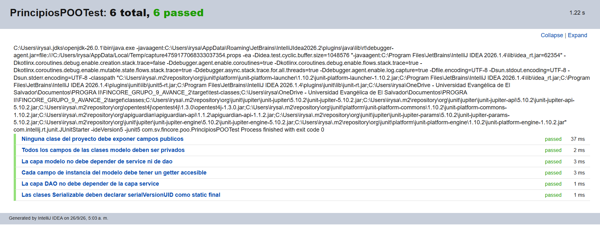
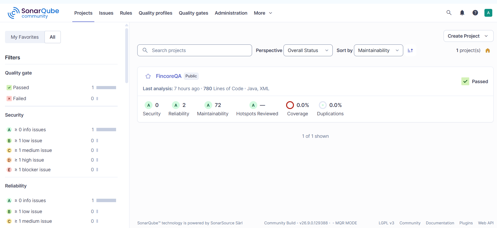
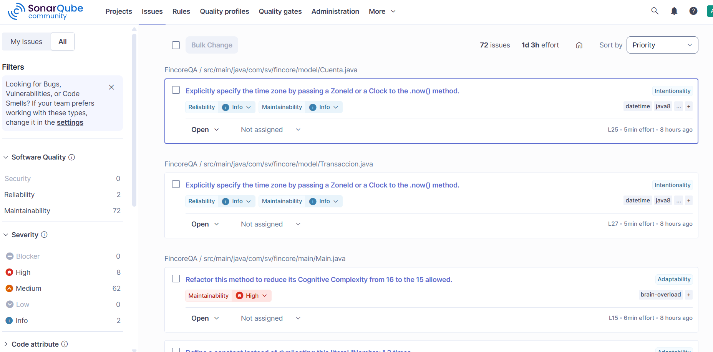
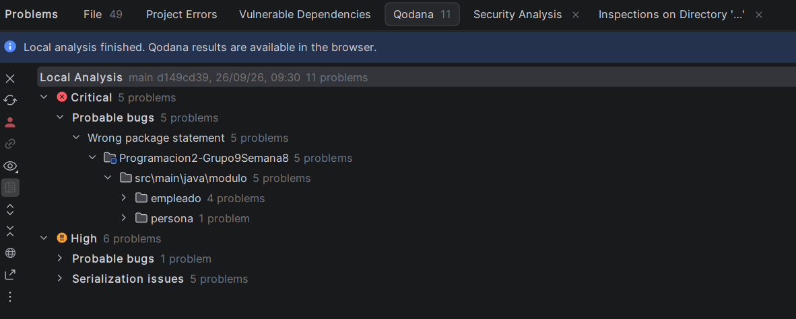
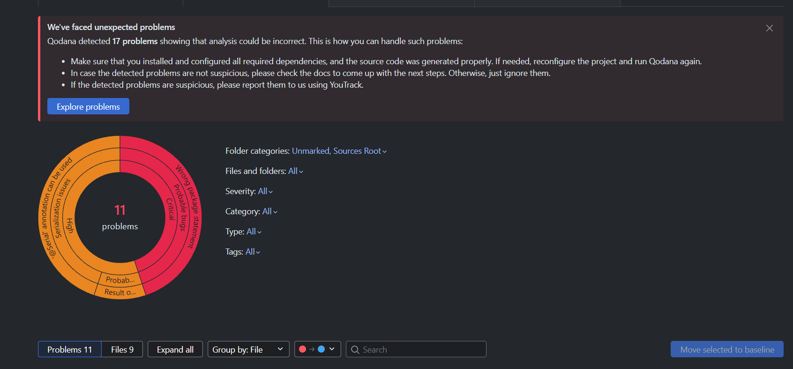
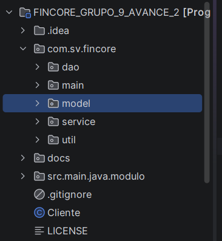
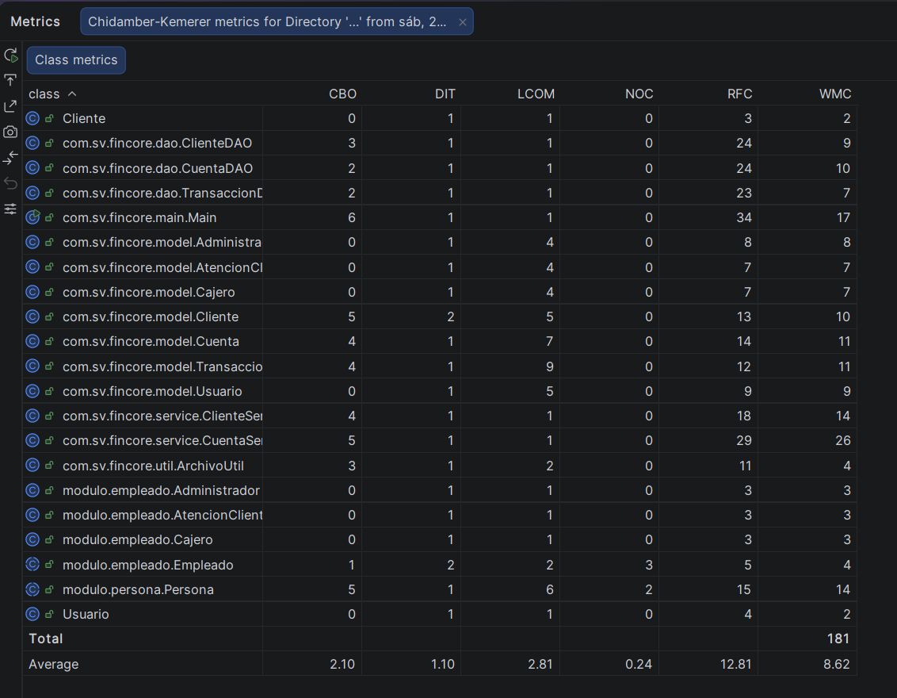

# Pruebas Técnicas para verificar principios de POO
1. Pruebas de análisis estático (revisión de estructura)

Se analiza el código fuente para verificar que cumplan con los principios POO.

a) *Verificación de Encapsulamiento*: se inspecciona que los atributos de las clases sean *private* o *protected* y que se accedan a ellos a través de métodos *getters* y *setters*.

Checklist de clases (si cumple se coloca PASS)
- Administrador: PASS
- AtencionCliente: PASS
- Cajero: PASS
- Cliente: PASS
- Transaccion: PASS
- Usuario: PASS
- ClienteDAO: PASS
- CuentaDAO: PASS
- TransaccionDAO: PASS
- ClienteService: PASS
- CuentaService: PASS

Para realizar una verificación más profunda se usa SonarQube integrado con Maven y también se utiliza Qodana que está integrado en Intellij.
El primer paso para ejecutar la verificación con Maven es crear el archivo pom.xml en la raíz del proyecto y luego ejecutar 'mvn clean verify'. Del análisis de obtubieron los siguientes resultados.

En general, el código cumple con los pricipios de POO, sin embargo hay issues de calidad que afectan el mantenimiento del código.

Con Qodana se crea el archivo *qodana.yaml* y el reporte se puede abrir el browser: http://localhost:63342/qodana.ide/idea.html?projectKey=d2ce2292ca29d5ec336df748bed48031&_qdt=e8bd9044-710d-402f-a008-a3c3a77be0e5&theme=dark

El análisis identifica 17 issues, estos issues se revisarán uno a uno y los comentarios serán agregados en las clases correspondientes para su corrección.

b) *Validación de jerarquías (herencia y polimorfismo)*: 
Se ha creado la clase Persona de la cual deben heredar Empleado, Cliente y Usuario. Al inicio de la creación del repositorio y la separación de roles, se creó una estructura del proyecto:

Luego se creó la clase Persona y Empleado y se colocaron en la carpeta  src/main/java/modulo, pero esto genera duplicidad de argumentos en las clases porque no se está usando la Herencia. Para corregir el issue se propone el cambio de estructura a:

src/main/java/com/sv/fincore/model
Dentro de model vivirán las clases: Persona (clase abstracta), Cliente (extends Persona), Empleado (clase abstracta y extends Persona) y Usuario (extends Persona).

c) *Métricas de cohesión y acoplamiento*:

Con el plugin **MetricsReloaded** se pueden calcular las métricas LCOM (Lack of Cohesion of Methods), estas métricas miden si los métodos de una clase usan los mismos atributos. Un LCOM alto indica baja cohesión, la clase hace demasiadas cosas y rompe el principio de Responsabilidad Única.
Otra métrica importante es CBO (Coupling Between Objects), que mide cuántas otras clases conoce una clase. Un CBO alto indica acoplamiento excesivo, lo que dificulta la reutilización, miemtras sea bajo, es más fácil de mantener aislado. 

Resultados obtenidos en la primera prueba:

Según los resultados obtenidos se evidencia el issue de la falta de Herencia en las clases, con valores DIT (Depth of Inheritance Tree) = 1.

LCOM = 1 en las clases ClienteService y CuentaService, reflejan alta cohesión en la lógica de negocio.